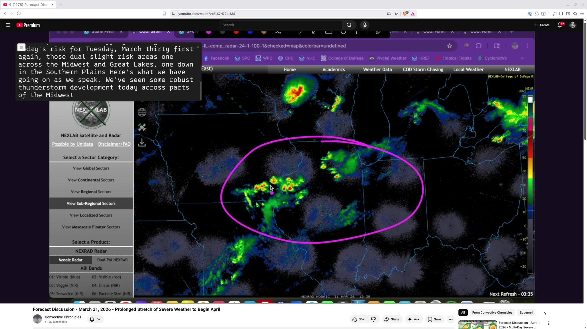

# Larmindon

Real-time speech-to-text captioning for Linux. Captures system audio via PipeWire and transcribes it using the Nemotron ASR model, displaying live captions in a minimal overlay window.

Note that Flatpak packaging is still a work in progress. It will install and run, but there seems to still be an issue in model loading or similar that I'm trying to work out. If you have all the dependencies installed `cargo run` should work fine.



## Features

- **Real-time captioning** of any system audio source (application streams, microphones, monitor outputs)
- **Minimal overlay UI** — borderless window with just a hamburger menu and close button
- **Always-on-top** via standard compositor controls (right-click the window)
- **Grab-anywhere** window dragging, resizable
- **PipeWire integration** with live device detection and seamless source switching
- **VAD gating** (Silero) — only transcribes when speech is detected
- **Configurable font** family and size for the caption display
- **Diagnostics database** (SQLite) logging inference timing, VAD events, and session data

## Requirements

- Linux with PipeWire (or CPAL as fallback)
- GTK 4.12+
- [Nemotron ASR model](https://huggingface.co/altunenes/parakeet-rs/tree/main/nemotron-speech-streaming-en-0.6b) (via parakeet-rs)
- Silero VAD model (included in `models/`)

## Build & Run

```sh
cargo run
```

On first run, configure the model path in Preferences (hamburger menu > Preferences).

### Environment Variables

| Variable | Values | Default | Purpose |
|----------|--------|---------|---------|
| `CHUNK_MS` | 80, 160, 560, 1120 | 560 | ASR chunk size in ms |
| `INTRA_THREADS` | 1+ | 2 | ONNX intra-op parallelism |
| `INTER_THREADS` | 1+ | 1 | ONNX inter-op parallelism |
| `PUNCTUATION_RESET` | 0/1 | 1 | Reset decoder at sentence boundaries |
| `LARMINDON_AUDIO_BACKEND` | cpal, pipewire | auto | Force audio backend |

### Cargo Feature Flags

- `pipewire` (default) — PipeWire audio capture
- `cpal` (default) — CPAL audio capture (fallback)

## Building for Packaging

The project uses [Meson](https://mesonbuild.com/) to handle installation of the binary, desktop file, and icons. This wraps `cargo build` — you don't need to change your Rust workflow.

### Prerequisites

- Meson (>= 0.59)
- Ninja
- ImageMagick (`magick` CLI) — for resizing the app icon

On Arch/Manjaro:

```sh
sudo pacman -S meson imagemagick
```

On Fedora:

```sh
sudo dnf install meson ImageMagick
```

On Ubuntu/Debian:

```sh
sudo apt install meson imagemagick
```

### Build & Install

```sh
meson setup builddir
meson compile -C builddir
meson install -C builddir            # installs to /usr/local by default
```

To install to a staging directory (e.g., for packaging):

```sh
DESTDIR=/path/to/staging meson install -C builddir
```

This installs:
- Binary → `$prefix/bin/larmindon-gtk`
- Desktop file → `$prefix/share/applications/com.davidedmiston.Larmindon.desktop`
- Icons (48–256px) → `$prefix/share/icons/hicolor/<size>x<size>/apps/com.davidedmiston.Larmindon.png`

### Flatpak

Build and install locally:

```sh
flatpak-builder --user --install --force-clean .flatpak-build com.davidedmiston.Larmindon.yml
```

Run the installed Flatpak:

```sh
flatpak run com.davidedmiston.Larmindon
```

Requires the GNOME 49 runtime, SDK, Rust, and LLVM extensions from Flathub:

```sh
flatpak install flathub org.gnome.Platform//49 org.gnome.Sdk//49 \
  org.freedesktop.Sdk.Extension.rust-stable//24.08 \
  org.freedesktop.Sdk.Extension.llvm20//25.08
```

## Configuration

Settings are stored in `~/.config/larmindon/settings.json` and can be edited via the Preferences dialog. The diagnostics database is at `~/.config/larmindon/larmindon_diag.sqlite`.

## Architecture

```
GTK main thread
  └─ Engine thread (receives Command via mpsc)
       ├─ PipeWire/CPAL audio capture → pushes mono f32 into shared buffer
       └─ Processing thread (per session)
            ├─ Drains shared buffer
            ├─ Resamples to 16kHz (rubato)
            ├─ VAD gating (Silero ONNX, 512-sample frames)
            └─ ASR inference (Nemotron, configurable chunk size)
```

Engine → UI communication uses `std::sync::mpsc`, polled by a glib timeout on the GTK main thread.

## License

MIT — see [LICENSE](LICENSE).

This application dynamically links to GTK4, GLib, and PipeWire which are licensed under LGPL-2.1-or-later. See [THIRD_PARTY_LICENSES.md](THIRD_PARTY_LICENSES.md) for details.
